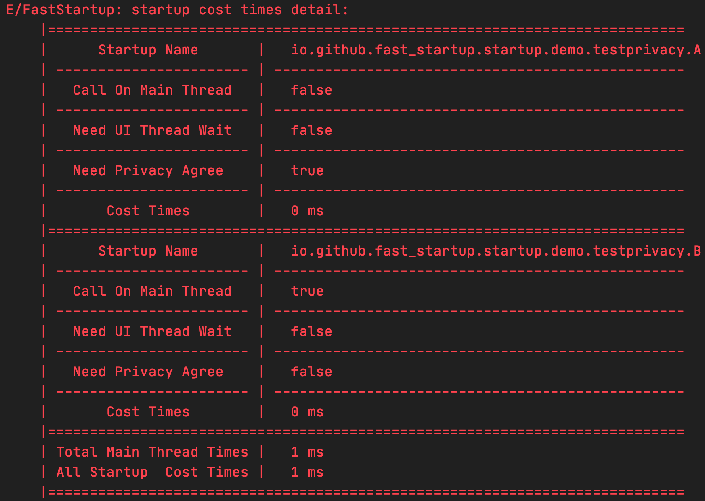

# FastStartup
`FastStartup`是一个组件启动框架，旨在帮助开发人员能够简单、高效地进行各种组件的初始化操作。

## 特点
简单、高效、支持节藕。
没有过多的启动配置方式，只为提供简单的使用体验。
全程无反射，无IO操作，能给您提供最快的启动速度。

## 使用它你能得到什么？
1.  全程无反射，无IO操作，提供最快的启动速度
2.  组件只需要关注自己依赖的其他组件，自动维护初始化顺序
3.  组件支持配置运行在UI线程和非UI线程
4.  支持UI线程等待操作，可以让UI线程阻塞到必要组件初始化完成，而必要组件可以运行在任意线程
5.  支持组件初始化参数配置，您可以创建一个任意形式配置信息，该配置信息将贯穿所有组件的初始化操作
6.  支持节藕，采用接口进行依赖管理，避免组件间的强依赖，让您的工程更加简洁
7.  支持组件自动注入，提供AOP方案，让您无需再处理每一个组件，只需要一个注解就可以自动进行初始化
8.  支持组件完成回调，提供了三种回调，分别为每个组件初始化完成的回调、UI线程任务完成的回调、所有任务完成的回调
9.  支持组件初始化耗时统计
10. 支持依赖缺失检测和依赖循环依赖检测

## 使用方式
### 1. 基础配置
在项目工程目录下`build.gradle`中添加依赖
```
dependencies {
    implementation "io.github.wizzxu:fast-startup:0.0.1-SNAPSHOT"
}
```
### 2. 组件初始化
在`Application onCreat()`方法中进行初始化和启动
```
class App : Application() {
    override fun onCreate() {
        super.onCreate()
        FastStartup.init().start()
    }
}
```
在`init()`方法中需要传入配置信息
```
简单配置
FastStartup.init(StartupConfig(application = this, BuildConfig.DEBUG)).start(listOf(A(), B()))
详细配置
FastStartup.init(
    StartupConfig.Builder()
        .setApplication(this)                    //application (默认为空)
        .setIsDebug(BuildConfig.DEBUG)           //是否是debug (默认为空)
        .setParams(mapOf("key" to "value"))      //通用配置参数 (默认为空)
        .setEnableTimeStatistics(true)           //是否打印每一个startup启动耗时(需要日志级别Log.ERROR以下，默认不分析耗时)
        .setLogLevel(Log.DEBUG)                  //组件内打印的日志级别 (默认不打印)
        .setStartupCompleteListener(object : StartupCompleteListener {
            override fun startupComplete(startup: IStartup<*>) {
                SLog.d("FastStartup", "目前完成的startup为:" + startup::class.java.simpleName)
            }

        })
        .setUIStartupCompleteListener(object : UIStartupCompleteListener {
            override fun startupComplete() {
                SLog.d("FastStartup", "所有运行在UI线程和需要UI线程等待的Startup已经全部完成")
            }
        })
        .setAllStartupCompleteListener(object : AllStartupCompleteListener {
            override fun startupComplete() {
                SLog.d("FastStartup", "所有Startup已经全部完成")
            }
        })
        .build()
).start(listOf(A(), B()))
```

在`start()`方法中需要传入组件列表信息
组件需要实现`IStartup`接口，具体详细用法，请查看[`IStartup`](https://github.com/WizzXu/FastStartup/blob/main/fast-startup-api/src/main/java/io/github/fast_startup/IStartup.kt)

```
class A : IStartup<String> {
    override fun start(context: Context?, isDebug: Boolean?, any: Any?): String? {
        return null
    }
}

class B : IStartup<String> {
    override fun start(context: Context?, isDebug: Boolean?, any: Any?): String? {
        return null
    }

    override fun runOnUIThread(): Boolean {
        return true
    }

    override fun dependencies(): List<Class<out IStartup<*>>>? {
        return listOf(A::class.java)
    }
}
```
### 3. 获取组件实例对象获取获取组件初始化返回的结果
```
获取组件实例对象
val class1:A? = FastStartup.getStartup(A::class.java)
val class2:IA<*>? = FastStartup.getStartup(A::class.java)
val class3:IA<*>? = FastStartup.getStartup(IA::class.java)

获取组件`start`方法返回的结果
Log.d("TestGetResult", "${FastStartup.getStartupResult(A::class.java)}")
Log.d("TestGetResult", "${FastStartup.getStartupResult(IA::class.java)}")
```
至此，您已经可以愉快的使用`FastStartup`了

## 依赖环检测和缺失检测
在FastStartup启动的时候会自动进行依赖环检测和缺失检测
如果依赖有环，会抛出异常并会打印如下信息


如果依赖有缺失，会打印如下消息


## 耗时统计


## 高级用法 [节藕、AOP](zdoc/AdvancedUsage.md)请查看链接文档
